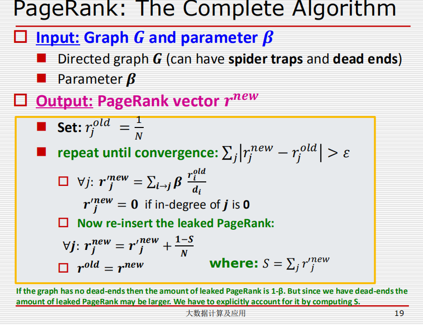
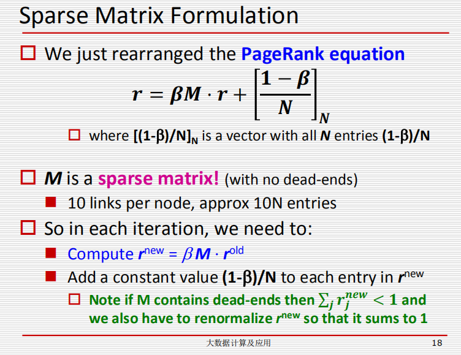

## 两个思路：

### 思路1：

对有出度计算rank值，遍历节点完成计算，每轮迭代添加损失的rank

### 思路2：

幂迭代算法：利用矩阵乘法求解

#### data_prepare.py：

1. 首先读出所有的节点数(pageNum=7115)，按顺序排好，然后依次给予编码0-7114。0-7114分别对应的节点依次`index_list.txt`
2. 按照上一步的编码映射，将原始数据重新编码,生成新的`new_data.txt`，节点的号码替换为编码后的号码
3. 对`new_data`，计算每个节点的出度，保存形式：每个节点对应一个字典：`src degree dest`（所以最后每行存的是字符化后的字典值）存入`Mat2.txt`，总行数为`pageNum`
4. 将上一步中，改为按`dest`排序后，每行存入  `src` , `degree` , 和一个`dest`。只需要保存有出度的节点即可。存入文件`Mat.txt`
5. 初始化`rank`值并保存至`old_rank.txt`

#### PR_without_block.py：

本程序中使用了幂迭代的方法计算，采用了稀疏矩阵，但未将数据分块，实现`pagerank`的计算。构建稀疏矩阵时，使用scipy中的coo_matrix，转成bsr_matrix后使用scipy.sparse内置的.dot()方法进行矩阵乘法。

   1.     读入`index_list`获取节点数

   2.     读入`old_rank.txt`,初始化`old_rank`，`new_rank`

   3.     读入`Mat2.txt`，（src degree dest），构建稀疏矩阵M

          M 的构建：

       ​			`i->j`

       ​		   对出度为`d(d!=0)`的节点`i`和它的目的节点`j`，`M[j][i]`= $\frac{1}{d}$

       ​		   对出度为 0 的节点`i`，矩阵中该节点对应列，`M[:][i]`=$\frac{1}{N}$

   4.     进入迭代

       + 在每一次迭代中，new_rank=$\beta \times M·old\_rank+\frac{1-\beta}{N}$
       + 比较 new_rank 中元素与old_rank中元素大小，如果所有元素之差均小于1e^-8^停止迭代
       +  更新`old_rank`
       
   5.     结束迭代，输出 new_rank 前100结果

#### PR_read_one.py:

本程序实现数据分块，每次从磁盘中读取目的节点为`i`的一组信息，即指向节点`i`的其他节点序号和出度。在此基础上计算节点`i`的`rank`值，每完成一个节点的`rank`值计算，释放内存。因为`I/O`较为频繁，程序运行时间较长，本地运行时长30min。

1.   读入`index_list.txt`获取节点数

2.   读入`old_rank.txt`，在内存中维护`rank`值数组

3.   每一次迭代中：

     + 对每个节点`i`，从`Mat.txt`读入`dest`为`i`的节点`j`的出度。

     + $rank(i)=\sum\frac{old\_rank(j)}{d(j)}$

     ​        更新`new_rank`

     ​        (每次`pagerank`前后的rank值数组是在内存中更新的，所以整体上来说节省的是原本构建稀疏矩阵需要的信息的空间)

     + $new\_rank+=\frac{1-\sum(new\_rank)}{N}$
     + 比较 new_rank 中元素与old_rank中元素大小，如果所有元素之差均小于1e^-8^停止迭代
+ 更新`old_rank`
  
4. 结束迭代，输出 new_rank 前100结果

#### PR_with_bolck.py:

本程序实现数据分块，将目的节点为  每个`block`中节点的信息读入内存，计算`rank`值，释放信息，读取计算下一个`block`中节点`rank`值需要的信息。

1.   读入`index_list.txt`获取节点数

2.   读入`old_rank.txt`，在内存中维护`rank`值数组

3.   每次一迭代中：

     + new_rank 清零

     + 对每个`block`:
       + 打开`Mat.txt`，读取目的节点为当前`block`中节点的行，存入内存中的列表`mat_list`
       + 计算该`block`中的节点的`rank`值，存入`new_rank`，$rank(i)=\sum\frac{old\_rank(j)}{d(j)}$
       + 释放从`Mat.txt`中读取的内容所占空间
       + 进入下一个block

     + $new\_rank+=\frac{1-\sum(new\_rank)}{N}$

     + 比较 new_rank 中元素与old_rank中元素大小，如果所有元素之差均小于1e^-10^停止迭代

     + 更新`old_rank`

4.   结束迭代，输出 new_rank 前100结果

   

